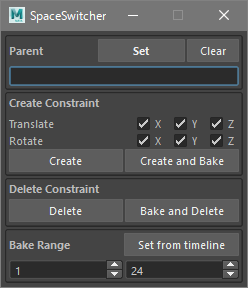

# **spaceSwitcher**
----

## Background
----
**spaceSwitcher** is a simple animation support tool which can be used to switch animation controller's space back and forth between appropriate parent nodes.  
  
When you are animating characters or props and working with animation controllers, you are sometimes likely to think that some of the controllers would be easier to handle under some other transform nodes than the controllers own coordinate spaces.  

And such situation is not permanent, which means the appropriate coordinate system of animation controller varies over time.  

**spaceSwitcher** is designed to deal with such situtaions by creating constraints to temporary parent and baking keyframes back to animation controller afterward.

## User's Guide - _for Animators_ -
----

Below are typical steps for animator to use this tool via UI.

* Launch UI  
    * In script editor, run the following MEL script:  

        `spaceSwitcher;`  

        If setup is properly done, a small window titled "SpaceSwitcher" will be launched.

        

* Set parent
    * Find a **parent** node:  
      **parent** is the node whose local space would enable simpler decomposition of motion you are working with.
    * Set **parent** node by doing one of the followings:
        * Select the **parent** node and click "Set" button.
        * Type the name of the **parent** node directly into the text field.

* Select targets
    * Find and select **targets** nodes:  
      **targets** are the nodes you are animating and you want to make easier to animate under the **parent** you specified above.

* Create constraints
    * Depending on your situation, do one of the followings:  
        * If you are about to start adding keyframes to the selected controllers and they don't have any aniamtion curves you want to keep, click "Create" button.
        * If the selected controllers have animation curves you want to keep, click "Create and Bake" button.
    * The step above creates a new locator under the specified **parent** node which drives the selected controllers by point constraint and orientation constraint.  
    The new locator is created for each selected target respecively and the name **cnst\__target_** is given, where **_target_** is the target name.

* Animate using **targets** and **cnst\__target_**
    * Now, each selected controller's animation is decomposed into local space of **cnst\__target_** and that of its own, you can animate with the proper transform depending on which component you are working with.

* Delete constraints
    * When the **cnst\__target_** finished the role as the temporary parent of the controller, it's time to bake animations back to the controller and delete constraints and **cnst\__target_**.
    * In order to delete constraints and **cnst\__target_**, make sure that **cnst\__target_** or **targets** is/are selected.
    * If you want to just delete the consraints and **cnst\__target_**, click "Delete" button.
    * If you need to bake resultant animation to the controller, click "Bake and Delete" button.

## Script Interface - _for Engineers and Technical Artists_ -
----

For engineers and technical artists, python script interface is also available.

### Modules
----

**`spaceswitcher`**  
Portal module for main class and functions, designed to be the interface, i.e. the only module that the users of this tool need to import.  
Their actual implementation is split into sub modules below.

----  
**`spaceswitcher.core`**  
Sub module for main class and functions implementation except for UI.

----
**`spaceswitcher.ui`**  
Sub module for UI implementation.

----
**`spaceswitcher.utils`**  
Sub module for implementation of basic utility functions used by modules above.

----

### Class
----

**`SpaceSwitcher`**

#### Description
This class encapsulates constraint structure of a target controller and a transform which works as temporary "parent".  
Operations such as creating or deleting constraints with or without keyframe bake are accessible via instance methods.  

#### Constructor

```python
spaceswitcher.SpaceSwitcher(target=None, locator=None)
```

* Parameters:
    * **`target`** **:** `pymel.core.general.PyNode`  
      Target transform node you are animating.  

    * **`locator`** **:** `pymel.core.general.PyNode`  
      Constraint locator node which drives target transform via point constraint and orientation constraint.

For a new constraint structure, a class instance must be constructed with a target node before creating constraints:  

```python
switcher = spaceswitcher.SpaceSwitcher(target=target)
```

From an existing constraint structure, a class instance can be constructed and restored with a target node and/or a constraint locator:  

```python
switcher = spaceswitcher.SpaceSwitcher(target=target)
```

or  

```python
switcher = spaceswitcher.SpaceSwitcher(locator=locator)
```

or  

```python
switcher = spaceswitcher.SpaceSwitcher(target=target, locator=locator)
```

#### Class methods

```python
get_target_from_locator(locator)
```

* Parameters:
    * **`locator`** **:** `pymel.core.general.PyNode`  
      Constraint locator.

* Return value:  
    Target transform node. `pymel.core.general.PyNode`

* Description:  
    Obtains target transform from constraint locator ***locator***.
----

```python
get_locator_from_target(target)
```

* Parameters:
    * **`target`** **:** `pymel.core.general.PyNode`  
      Target transform.

* Return value:  
    Constraint locator node. `pymel.core.general.PyNode`

* Description:  
    Obtains constraint locator from ***target***.
----

```python
get_bakerange_from_locator(locator)
```

* Parameters:

    * **`locator`** **:** `pymel.core.general.PyNode`  
      Constraint locator.

* Return value:  
    A dictionary containing bake range information. `dict`

* Description:  
    Obtains bake framerange from values stored in constraint locator ***locator***'s custom attributes and returns as a dictionary with keys and values shown below:  

    | key                      | value                          | type   |
    | :----------------------: | :----------------------------: | :----: |
    | `spaceSwitcherStartInit` | `True` if start is initialized | `bool` |
    | `spaceSwitcherStart`     | bake start frame               | `int`  |
    | `spaceSwitcherEndInit`   | `True` if end is initialized   | `bool` |
    | `spaceSwitcherEnd`       | bake end frame                 | `int`  |

----

#### Instance methods

```python
list_target_constraints(typ)
```

* Parameters:
    * **`typ`** **:** `unicode`  
      Constraint type. `'translate'` or `'rotate'` can be accepted.

* Return value:  
    A list of constraint nodes. `list of pymel.core.general.PyNode`

* Description:  
    Obtains constraint nodes which drive the target node's attributes which ***typ*** specifies.
----

```python
list_driven_target_channels(typ)
```

* Parameters:

    * **`typ`** **:** `unicode`  
      Constraint type. `'translate'` or `'rotate'` can be accepted.

* Return value:  
    A list of driven attributes. `list of pymel.core.general.Attribute`

* Description:  
    Obtains component attributes of target node's ***typ*** attribute which are really driven by constraint locator.
----

```python
switch_space(parent, translate_switches, rotate_switches, bake=False, start=1, end=24)
```

* Parameters:

    * **`parent`** **:** `pymel.core.general.PyNode`  
      A transform node which you want make serve as temporary parent.

    * **`translate_switches`** **:** `[bool, bool, bool]`  
      Translate constraint switch for x, y and z component respectively.

    * **`rotate_switches`** **:** `[bool, bool, bool]`  
      Rotate constraint switch for x, y and z component respectively.

    * **`bake`** **:** `bool`  
      If True, keyframes are baked to constraint locator so that target's animation is kept the same after constraints are made.

    * **`start`** **:** `int`  
      Start frame of keyframe bake.

    * **`end`** **:** `int`  
      End frame of keyframe bake.

* Return value:  
    Constraint locator, which is created to constrain the target node. `pymel.core.general.PyNode`

* Description:  
    Creates a new locator under ***parent*** as the constraint locator and constraint nodes which drive the target node, according to ***translate_switches*** and ***rotate_switches*** channel settings.  
    If ***bake*** is True, keyframes are baked to constraint locator so that target's animation is kept the same after constraints are made.
----

```python
delete_constraints(bake=False, start=None, end=None)
```

* Parameters:

    * **`bake`** **:** `bool`  
      If True, the resultant animation is baked to the target node before constraints are deleted.

    * **`start`** **:** `NoneType` or `int`  
      Start frame of keyframe bake. If `None` is specified, start frame is obtained from the value stored in locator's custom attribute.  
      A specific integer value can be used to override the start frame stored as custom attribute.

    * **`end`** **:** `NoneType` or `int`  
      End frame of keyframe bake. If `None` is specified, end frame is obtained from the value stored in locator's custom attribute.  
      A specific integer value can be used to override the end frame stored as custom attribute.

* Return value:  
    The target node. `pymel.core.general.PyNode`

* Description:  
    Deletes the constraint locator and constraint nodes which drive the target.  
    If ***bake*** is True, the resultant animation is baked to the target node before constraint structure is deleted.

### Functions
----
Handy functions for main operations like switching space or deleting switching structure are also provided.  
Coding with class **`SpaceSwitcher`** is supposed to be efficient for engineers and technical artists.  
While, for those who are not familiar with class or pymel's `PyNode` object, the functions described below might be handy.  
These functions accept not only PyNode object but also node name string as node arguments.  
And they also can run based on current selection.

```python
spaceswitcher.switch_space(targets, parent,
                           translate_switches=[True, True, True],
                           rotate_switches=[True, True, True],
                           bake=False, start=1, end=24)
```

* Parameters:

    * **`targets`** **:** `list of PyNode` or `PyNode` or `list of unicode` or `unicode` or `NoneType`  
      Target transform node(s).
      If `None` is specified, current selection is used as targets.

    * **`parent`** **:** `PyNode` or `unicode`  
      A transform node which you want to make serve as temporary parent.

    * **`translate_switches`** **:** `[bool, bool, bool]`  
      Translate constraint switch for x, y and z component respectively.

    * **`rotate_switches`** **:** `[bool, bool, bool]`  
      Rotate constraint switch for x, y and z component respectively.

    * **`bake`** **:** `bool`  
      If True, keyframes are baked to constraint locators so that targets' animations are kept the same after constraints are made.

    * **`start`** **:** `int`  
      Start frame of keyframe bake.

    * **`end`** **:** `int`  
      End frame of keyframe bake.

* Return value:  
    A list of constraint locaros, which are created to constrain the target nodes. `list of PyNode`

* Description:  
    Creates a new locator under ***parent*** as the constraint locator and constraint nodes which drive each target node according to ***translate_switches*** and ***rotate_switches*** channel
    settings.  
    If ***bake*** is True, keyframes are baked to each constraint locator so that each target's animation is kept the same after constraints are made.  
    As parameter ***targets***, several argument types can be accepted and if `None` is specified, current selected nodes are considered as targets.
----

```python
spaceswitcher.delete_switch_space_constraints(targets=None, locators=None,
                                              bake=False, start=None, end=None)
```

* Parameters:

    * **`targets`** **:** `list of PyNode` or `PyNode` or `list of unicode` or `unicode` or `NoneType`  
      Target transform node(s).

    * **`locators`** **:** `list of PyNode` or `PyNode` or `list of unicode` or `unicode` or `NoneType`  
      Constraint locator node(s).

    * **`bake`** **:** `bool`  
      If True, the resultant animation is baked to the target node before constraints are deleted.

    * **`start`** **:** `NoneType` or `int`  
      Start frame of keyframe bake. If `None` is specified, start frame is obtained from the value stored in locator's custom attribute.  
      A specific integer value can be used to override the start frame stored as custom attribute.

    * **`end`** **:** `NoneType` or `int`  
      End frame of keyframe bake. If `None` is specified, end frame is obtained from the value stored in locator's custom attribute.  
      A specific integer value can be used to override the end frame stored as custom attribute.

* Return value:  
    A list of target nodes. `list of PyNode`

* Description:  
    Deletes the specified constraint locator nodes and their constraint nodes.  
    Constraint locator nodes can be obtained by specifying target nodes also.  
    If both ***targets*** and ***locators*** is `None`, constraint locators are obtained from current selection.  
    If ***bake*** is True, the resultant animation is baked to each target node before constraint structure is deleted.
